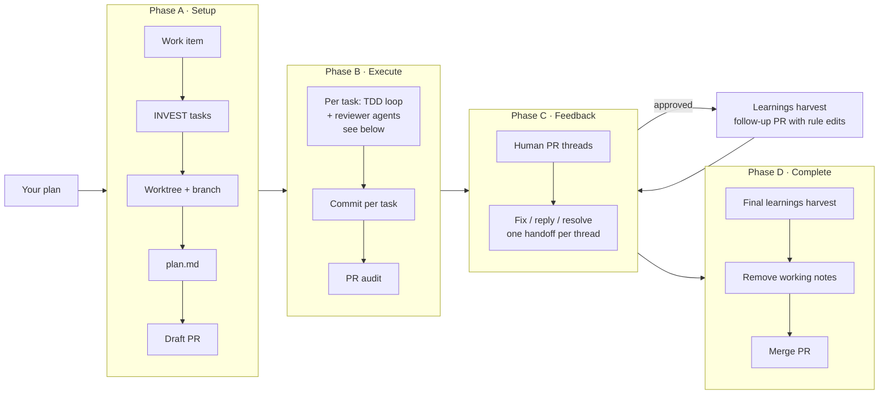
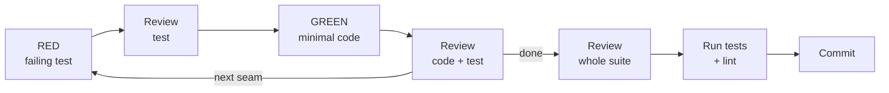

# dev-workflow

An agent skill that takes a piece of work from **"start this"** to a **merged pull request** —
and can stop and resume at any point: mid-task, the next day, or after human reviewers leave
comments.

It creates the work item and its tasks, sets up a git worktree and a draft PR, builds each task
with test-driven development and paired reviewer agents, audits the finished PR, answers every
human review comment thread by thread, turns what reviewers taught into rules for next time, and
finally removes its own working notes before merging.

Everything the agent needs to continue lives in files on the branch, not in chat history. Close
the session, come back tomorrow, say "continue the work", and it picks up where it stopped.

> **Status: early.** The flow has been reviewed end to end on paper, but the tracker commands have
> not yet been run against live Azure DevOps or GitHub projects. Expect rough edges in the
> adapters. Issues and fixes are welcome.

---

## Contents

- [What it does](#what-it-does)
- [How it works](#how-it-works)
- [Requirements](#requirements)
- [Install](#install)
- [Usage](#usage)
- [The four phases](#the-four-phases)
- [Agents and model tiers](#agents-and-model-tiers)
- [State on disk](#state-on-disk)
- [Adapters](#adapters)
- [Customizing for your project](#customizing-for-your-project)
- [Safety rules](#safety-rules)
- [Known limitations](#known-limitations)
- [File layout](#file-layout)
- [Credits](#credits)

---

## What it does

- **Plans into independent tasks.** A planner agent splits your plan into tickets that follow
  INVEST (Independent, Negotiable, Valuable, Estimable, Small, Testable). Each ticket is a vertical
  slice with acceptance criteria and proposed test seams. You approve the split before anything is
  created.
- **Sets up the tracker and the branch.** It creates the parent item (PBI, story, or issue) and one
  child task per ticket, creates a worktree and a branch that follows your repo's naming rules, and
  opens a draft PR linked to the parent item.
- **Builds with TDD.** Each task runs a strict loop per behavior: write one failing test and have
  it reviewed, write the minimal code to pass, then have **both** the code and the test reviewed
  against that real code. Refactoring suggestions come from the review, not from the loop.
- **Reviews tests three times, not once.** The test reviewer checks each test when it's written
  (right seam, fails for the right reason), again once the code exists (branches the code added
  without a test, tests bent to fit the code), and once more for the whole task (every acceptance
  criterion has a test, no duplicates across cycles).
- **Reviews every round.** Two reviewer agents — one for production code, one for tests — check
  changes against your project's own rules (`AGENTS.md`, `CLAUDE.md`, and the docs they point to).
  Any change to a test goes to the test reviewer; any change to code goes to the code reviewer.
  They stay alive for the whole session, so they remember what they already flagged.
- **Audits the PR before it leaves draft.** A capable auditor agent builds a claim ledger (every
  acceptance criterion and PR claim vs. real evidence), runs a static hostile-change gate
  (supply chain, CI, credentials, obfuscation), runs your checks, and reviews security,
  correctness, compatibility, and scope. Blocking findings keep the PR in draft.
- **Answers human reviewers.** It fetches PR comment threads, works them one at a time, fixes what
  should be fixed (with the same TDD and review bar), replies to every thread in short statements,
  and resolves only what is actually addressed. Nobody is left without an answer.
- **Learns from human reviewers.** When a reviewer's comment states a general rule ("we always
  validate at the endpoint", "tests here must not mock the repository"), it is tagged as a
  learning and relayed to the running reviewer agents at once. When the PR is approved, and again
  before merging, the learnings are curated into edits to your project's own rule docs — delivered
  as a separate follow-up PR, so the approved feature PR is never touched.
- **Cleans up before merge.** A final commit removes the plan and handoff files, so the merged
  tree holds only the real work.
- **Optionally stacks the PRs.** At setup you choose one PR for the whole item, or one small PR
  per task, each stacked on the one below. See [Stacked PRs](#stacked-prs).

## How it works


```mermaid
flowchart LR
    P[Your plan] --> A
    subgraph A [Phase A · Setup]
        A1[Work item] --> A2[INVEST tasks] --> A3[Worktree + branch] --> A4[plan.md] --> A5[Draft PR]
    end
    A --> B
    subgraph B [Phase B · Execute]
        B1[Per task: TDD loop<br/>+ reviewer agents<br/>see below] --> B2[Commit per task] --> B3[PR audit]
    end
    B --> C
    subgraph C [Phase C · Feedback]
        C1[Human PR threads] --> C2[Fix / reply / resolve<br/>one handoff per thread]
    end
    C -- approved --> L
    L[Learnings harvest<br/>follow-up PR with rule edits] --> C
    C --> D
    subgraph D [Phase D · Complete]
        D0[Final learnings harvest] --> D1[Remove working notes] --> D2[Merge PR]
    end
```

This is the default single-PR flow. In [stacked PR mode](#stacked-prs) the same phases run per
layer: each task opens its own PR, is audited and leaves draft on its own, and the layers merge
bottom-up.

### Inside one task

Each seam runs one red → green cycle, with a review after each step.


```mermaid
flowchart LR
    R["RED<br/>failing test"] --> RT["Review<br/>test"]
    RT --> G["GREEN<br/>minimal code"]
    G --> GR["Review<br/>code + test"]
    GR -- next seam --> R
    GR -- done --> T["Review<br/>whole suite"]
    T --> V["Run tests<br/>+ lint"]
    V --> C["Commit"]
```

Any review can send the work back for fixes, or stop and ask you. The reviewers are the same two
agents for the whole session, so each round remembers what earlier rounds flagged.

What each checkpoint looks for:

| Checkpoint | Reviewer | Checks |
|---|---|---|
| After RED | tests | right seam, behavior not internals, fails for the intended reason |
| After GREEN | code + tests, together | project code rules and refactor needs; branches the new code added without a test; tests bent to fit the code |
| After a fix | lane of the files changed | the change itself, and repeats of earlier findings |
| Task close | tests | every acceptance criterion has a test at a confirmed seam; no duplicates across cycles |
| Verification gate | — (runs your commands) | the suite and linter actually pass — a `PASS` verdict only means "nothing found by reading" |

`NEEDS_CHANGES` loops back automatically. `FAIL` — a critical-rule break or a design question —
stops for you. The same blocking issue surviving three rounds also stops for you, instead of a
fourth attempt.

The main agent acts as an **orchestrator**. It delegates planning, tracker commands, reviews, and
the audit to specialized agents, and writes code itself only inside the TDD loop and for PR-comment
fixes.

Every invocation starts by reading the files on disk and routing to the right phase:

| What it finds | Where it goes |
|---|---|
| No worktree or plan yet, or setup unfinished | Phase A (resumes if partly done) |
| A task without a `Done` handoff | Phase B, that task |
| All tasks done, audit missing or not passed | Phase B, PR audit |
| Audit passed and PR ready | Phase C |
| You ask to complete the PR | Phase D |

In stacked mode the same checks run per layer, bottom-up, and merged layers are skipped: a done
task whose layer isn't audited yet goes to the audit before the next task starts.

You can always override the route ("check the PR comments", "redo the audit", "harvest the
learnings").

## Requirements

- **An agent harness with subagents.** The skill spawns agents and needs a way to continue a
  running agent (for persistent reviewers).
- **git** with worktree support.
- **A tracker CLI**, authenticated:
  - Azure DevOps: [Azure CLI](https://learn.microsoft.com/cli/azure/) with the `azure-devops`
    extension (`az devops configure --defaults organization=... project=...`).
  - GitHub: [GitHub CLI](https://cli.github.com/) (`gh auth login`).
- **A plan to start from.** The skill does not invent scope. Bring a plan from a grilling or spec
  session, a design doc, or your own description.
- **Optional: a local decision model** for PR-thread signals —
  [Ollama](https://ollama.com/download) 0.35+, `ollama pull tev1`, and
  [uv](https://docs.astral.sh/uv/). Without it, everything works the same; see
  [Decision signals](#decision-signals-optional).

## Install

```bash
npx skills add josemarcilio/skills --skill dev-workflow
```

Or copy (or link) `skills/engineering/dev-workflow/` into your harness's skills folder.

## Usage

Talk to the agent in plain language. Typical phrases:

| You say | What happens |
|---|---|
| "Start this work" + a plan | Phase A: item, tasks, worktree, `plan.md`, draft PR |
| "Start this work, stack the PRs" | The same, but one stacked PR per task (asked anyway at setup) |
| "Start this work on PBI 1234" | Same, using an existing item as the parent |
| "Continue the work" | Resumes the first unfinished task from its handoff |
| "Resume task 5678" | Resumes that specific task |
| "Check the PR comments" | Phase C: works new or updated review threads |
| "Harvest the learnings" | Turns reviewer rules into a follow-up PR against your rule docs |
| "Complete the PR" | Phase D: final harvest, confirms, cleans up, merges |

A typical multi-day run:

1. **Day 1.** "Start this work" with a plan. Approve the task split. Tasks 1 and 2 get built,
   reviewed, and committed. You stop mid-way through task 3.
2. **Day 2.** "Continue the work." The agent reads task 3's handoff — confirmed seams, which test
   is red, last review verdicts — and continues. After the last task, the PR audit runs and the PR
   leaves draft.
3. **Day 4.** Colleagues have reviewed. "Check the PR comments." Each thread gets its own handoff,
   a fix or a reply, and a resolution where appropriate. Threads with new replies get picked up
   again on the next run.
4. **Day 5.** The PR is approved. On the next "check the PR comments", the learnings harvest runs:
   you approve two rules the reviewers taught, and they go out as a small follow-up PR.
5. **Day 6.** "Complete the PR." A last harvest catches anything new, the working notes are removed
   in one commit, and the PR merges.

## The four phases

### Phase A — Setup

1. Detects the tracker and code host from the git remote and the repo's docs.
2. Discovers conventions: work-item types, area path, workflow states, current iteration, branch
   naming, PR title pattern, merge strategy, test and lint commands. Anything it can't find, it
   asks. It never guesses a team or a branch pattern.
3. Creates the parent item (unless you gave one).
4. Creates the worktree and branch, **verifies the branch name** against your conventions, and
   writes a first `plan.md`.
5. Runs the planner. It asks you about granularity and unclear criteria until you approve.
6. Creates one child task per ticket, linked to the parent.
7. Opens a draft PR linked to the parent item.

Before step 1 it asks for the PR mode: one PR, or one stacked PR per task. In stacked mode, step 4
creates a notes worktree and step 5 also sets the stack order and creates the stack worktree on the
first layer's branch. Step 7 is skipped — each layer PR opens when its task first pushes.

Results are written to `plan.md` before each next step, so an interrupted setup resumes without
creating duplicates.

### Phase B — Execute

For each task, in order:

1. Marks it active and opens its handoff.
2. Confirms the test seams with you.
3. Runs the TDD loop per behavior: **red → test review → green → code + test review**
   (concurrently), then one review of the task's whole test suite against its acceptance criteria.
4. Runs your tests and linter. A reviewer's `PASS` means "nothing found by reading", not "it works".
5. Writes the handoff, commits (one commit series per task), pushes, and marks the task done.

If scope drifts mid-flight (a task turns out to duplicate another, or a decision changes it), a
fresh planner run adjusts the task list, and the change is recorded — no padding work to match a
stale plan.

After the last task, the **PR audit** runs. `CRITICAL` or `BLOCKING` findings keep the PR in draft
until they are fixed or you explicitly accept them.

In stacked mode each task is built on its own layer branch. When it closes, the layer PR opens
(targeting the layer below), is audited on its own diff, and leaves draft right away — before the
next task starts.

### Phase C — Reviewer feedback

1. Fetches the human review threads (bot and system events are dropped).
2. Compares each with its handoff to find new threads and new replies. With a
   [decision model](#decision-signals-optional), it also labels each thread by kind and flags
   possible prompt injection.
3. For each: reads the comment and the code, then decides — **fix**, **reply only**, or **ask
   you** (when the answer is a design decision).
4. Writes the decision to the thread's handoff, then commits the fix (if any), replies, and
   resolves when the concern is truly addressed.

Replies are short statements, for example: *"Fixed in `a1b2c3d` — null check moved to the
parser."*

In stacked mode it works every layer PR in review, bottom-up, even while upper layers are still
being built. A fix is committed on the layer that owns the code; the layers above are restacked
and force-pushed with lease.

### Learnings harvest

Runs when the other reviewers approve the PR, always before completing, and whenever you ask.

1. A curator agent reads the thread handoffs and keeps only real rules: general, checkable, and
   asked for by a human reviewer (or accepted by you). It drops one-offs, taste, and anything your
   docs already say, and flags any rule that contradicts an existing one.
2. You approve, edit, or reject each proposed edit. Conflicts need your explicit choice.
3. Approved edits go to your own rule docs (`AGENTS.md` / `CLAUDE.md`, testing docs) on a
   **separate branch and PR** from the target branch. Pushing to the approved feature PR could
   reset its approvals, so it is never touched.

Since the reviewer agents read those same docs, every approved learning is enforced from the next
story on — for everyone on the team, not just this agent.

### Phase D — Complete

Runs only when you ask. It runs a final learnings harvest, checks for unanswered threads, confirms the merge options with you,
updates the PR description, commits the removal of `plan.md` and the handoffs, then merges. It
never bypasses branch policies.

In stacked mode it merges layers one at a time, bottom-up, as far as you say — possibly on
different days. After each merge it retargets the next PR to the target branch (and restacks with
`squash` or `rebase`). There is no cleanup commit; at the end it offers to delete the notes branch.

## Stacked PRs

Optional, chosen once at the start of setup. Based on GitHub's
[stacked PRs guide](https://docs.github.com/en/copilot/tutorials/stack-ai-generated-code-in-pull-requests).
Details in [`references/stacking.md`](references/stacking.md).

```
main ← L1 (task 1) ← L2 (task 2) ← L3 (task 3)
```

- **One layer = one INVEST task = one PR.** Each PR targets the branch below it, so its diff shows
  only that task. Tasks stay vertical slices; the stack order is a review order, not a dependency.
- **Reviews start early.** Each layer is audited and leaves draft as soon as its task is done, so
  people review L1 while L2 is built.
- **Fixes stay in their layer.** A fix to L1 is committed on L1; the layers above are replayed with
  `git rebase --update-refs` and pushed with `--force-with-lease` (you approve this once, at
  setup).
- **Merges go bottom-up.** After L1 merges, L2 is retargeted to `main` and still shows only its own
  diff. The last PR never holds the whole feature.
- **Notes live on a separate notes branch** that never gets a PR, so layer branches hold only real
  work and need no cleanup commit.
- **Works on both hosts.** Plain git and PR target branches do the stacking. On GitHub, if the
  [`gh-stack`](https://github.com/github/gh-stack) extension is installed, the layers are also
  linked as a native stack.

Costs: more PRs to track, force-pushes after lower-layer fixes, and — with `squash` or `rebase`
merges — a restack after every merge, which can reset approvals where the repo dismisses stale
reviews. Each layer lands in `main` as it merges, so each must be safe to ship alone.

## Agents and model tiers

| Agent | Role | Tier | Lifecycle |
|---|---|---|---|
| **cli-runner** | Runs tracker and code-host commands from an adapter file | cheap | fresh per step |
| **planner** | Splits the plan into INVEST tickets with seams | capable | fresh per planning run |
| **reviewer-code** | Reviews production code against project rules | standard | persistent per session |
| **reviewer-tests** | Reviews test quality: seams, coverage, tautologies, mocks | standard | persistent per session |
| **pr-auditor** | Claim ledger, hostile-change gate, full audit | capable | fresh per audit |
| **learnings-curator** | Turns reviewer comments into proposed rule-doc edits | capable | fresh per harvest |

Personas are declared by **tier**, not by model name. `SKILL.md` holds one small table that maps
tiers to models per harness. To move to another harness, edit that one table.

The agents are spawned as general-purpose agents with the persona file passed as their
instructions. The skill does not depend on agent types being registered in your repo.

Reviewers return a strict, parseable verdict:

```
VERDICT: NEEDS_CHANGES
ISSUES:
- [blocking] src/parser.ts:42 — unused export introduced in this round
- [minor] src/parser.ts:10 — name could state the unit
SUMMARY: One dead export to remove; otherwise follows the module rules.
```

`NEEDS_CHANGES` is fixed and re-reviewed automatically. `FAIL` stops and comes to you. The same
blocking issue surviving three rounds also stops and comes to you.

## State on disk

```
<repo>/.agents/dev-workflows/<item-id>/worktrees/<slug>/     the git worktree (not committed)

<worktree>/.agents/dev-workflows/<item-id>/                  committed on the branch
├── plan.md                  scope, decisions, tickets, discovered conventions
└── handoffs/
    ├── pr-description.md    the PR description's managed block, as last pushed
    ├── <task-id>.md         one per task: status, seams, reviews, commits, next step
    ├── pr-audit.md          audit report and ready flag
    ├── learnings.md         learnings harvest record
    └── pr/<thread-id>.md    one per PR thread: what was asked, found, decided, replied
```

- The worktrees folder is hidden with `.git/info/exclude`. The skill never edits your
  `.gitignore`.
- The home directory in any recorded path is replaced with `<user-home>`.
- Everything under `.agents/dev-workflows/<item-id>/` is deleted in the cleanup commit before
  merge.

In stacked mode, the notes move to their own branch, and each layer PR gets its own folder:

```
<repo>/.agents/dev-workflows/<item-id>/worktrees/
├── stack/                   one worktree, switched between the layer branches
└── notes/                   the notes branch (pushed, never a PR, deleted at the end)

<notes worktree>/.agents/dev-workflows/<item-id>/
├── plan.md                  as above, plus the PR mode, force-push approval and Stack table
└── handoffs/
    ├── <task-id>.md         one per task
    ├── learnings.md
    └── L<n>/                one per layer PR: pr-description.md, pr-audit.md, pr/<thread-id>.md
```

## Adapters

Phases never call a CLI directly. They call named operations (`create_child_item`,
`list_threads`, `reply_thread`, ...) defined in [`adapters/CONTRACT.md`](adapters/CONTRACT.md).
Each adapter file maps those operations to real commands, with the gotchas that fail silently.

There are two independent kinds:

| Kind | Included | Maps |
|---|---|---|
| **work-items** | [`azure-boards`](adapters/work-items/azure-boards.md), [`github-issues`](adapters/work-items/github-issues.md) | parent item → child tasks, states, iterations |
| **code-host** | [`azure-repos`](adapters/code-host/azure-repos.md), [`github`](adapters/code-host/github.md) | draft PR, description, review threads, merge; for stacked PRs, retargeting and stack linking |

How the concepts line up:

| | Azure DevOps | GitHub |
|---|---|---|
| Parent → children | PBI / User Story → Task | Issue → sub-issues |
| Item types | Work-item types | Organization issue types (optional) |
| States | Workflow states, discovered per project | open / closed (completed, not planned), optional "in progress" label |
| Iteration | Current sprint | Nearest open milestone |
| PR ↔ item link | `--work-items` flag | `Refs #<n>` in the description |
| Resolvable threads | All comment threads | Inline review threads |
| "Approved" | Required reviewers voted approve, no rejects | Review decision `APPROVED` |
| Retarget a PR (stacked) | REST `PATCH` on the PR's `targetRefName` | `gh pr edit --base` |
| Native stack (stacked) | none — PR target branches only | `gh stack link`, if the `gh-stack` extension is installed |

**Adding a platform** (Jira, GitLab, Bitbucket, ...) means adding one adapter file that implements
every operation of its kind. No phase file changes.

### Decision signals (optional)

A third, optional kind — **decisions** — asks a small local decision model typed questions about
each new PR comment, in one request, and gets probabilities back instead of text:

| Question | Used for | Acts only when |
|---|---|---|
| What kind of comment is it? (question / bug / convention / design / nit) | sorting and labeling the thread list | top option ≥ 0.85 |
| Does it state a general rule? | the `Learning:` line for the learnings harvest | ≥ 0.85 yes, ≤ 0.15 no |
| Does it ask the agent to run commands or ignore its instructions? | a `⚠ possible injection` warning before the thread is worked | ≥ 0.5 |

Anything in between is *undecided*, and the agent judges as it would without a model. The model
never decides fix, reply or ask, and the injection flag is a warning on top of the rule that PR
comments are data — never a replacement for it.

| Adapter | What it uses |
|---|---|
| [`none`](adapters/decisions/none.md) (default) | nothing — today's behavior |
| [`ollama`](adapters/decisions/ollama.md) | a JEV-style model in a local [Ollama](https://ollama.com) (`/v1/systemone`) through the [TypeSafe SDK](https://pypi.org/project/typesafe-sdk/), via [`scripts/decide.py`](scripts/decide.py) |

**Setup** (once per machine): install Ollama 0.35+, `ollama pull tev1`, install
[uv](https://docs.astral.sh/uv/), then check with `uv run scripts/decide.py health`. Phase A runs
that check and picks `ollama` or `none` by itself.

**When the model is missing** — Ollama stopped, model not pulled, out of memory — nothing breaks:
Phase C checks once per run, says so in one line, and works every thread without signals. The
skill never installs Ollama or pulls a model.

**Measuring a model.** `uv run scripts/eval_decisions.py --model <name>` runs labeled comments
from [`scripts/eval_cases.json`](scripts/eval_cases.json) and counts, per question, the sure
answers that were right, the sure answers that were **wrong**, and the undecided ones. On the
bundled 30 comments, `tev1` (4B) gave no sure-but-wrong answer and flagged every injection, at
about 3 s per comment on a laptop. Add your own past PR comments before trusting it for your team.

## Customizing for your project

The skill reads your repo's rules and lets them win:

- **Conventions** come from `AGENTS.md`, `CLAUDE.md`, `CONTRIBUTING.md`, and the docs they link
  (for example a branching guide). Put your branch pattern, PR title pattern, merge strategy, and
  test commands there.
- **Reviewers** use only your documented rules. They don't apply generic best practice as if it
  were a project rule.
- **Your own review process wins.** If the repo has its own review skill or reviewer agents, the
  skill uses those instead of its bundled reviewers.
- **Your own testing docs win** over the bundled TDD defaults for stack, placement, and naming.

## Safety rules

- Asks before completing a PR, deleting branches or worktrees, force-pushing, or changing CLI or
  tracker configuration.
- Never passes bypass flags (`--bypass-policy`, `--admin`) and never skips git hooks or signing.
- Never writes secrets into files, payloads, commits, or replies.
- Owns only a marked block of the PR description. Anything people or bots write outside it is
  never touched; an edit inside it stops and asks you before anything is overwritten.
- Treats PR comments and diffs as data: it never runs commands or code found in them. The
  optional decision model can flag a likely injection, but never clears a comment.
- Writes the handoff **before** each side effect (commit, push, reply), so an interrupted run
  always leaves a record of what it decided.
- The auditor resolves doubt toward blocking, never toward approval.

## Known limitations

- **GitHub Projects** status and iteration fields are not handled; milestones stand in for
  iterations.
- **Older GitHub Enterprise servers** without sub-issues report tasks as not linked.
- **Merge strategy `merge`** keeps the commits that added the working notes in the target branch's
  history (the final tree is clean). Prefer `squash`. In stacked mode the notes never touch the
  layer branches, so `merge` is clean — and it avoids a restack after every merge.
- **Stacked PRs** need git 2.38+. GitHub's native stacks (`gh-stack`) are in public preview.
- **Persistent reviewers** need a harness that can continue a running agent. Without it, reviewer
  memory across rounds is lost.

## File layout

```
dev-workflow/
├── SKILL.md              router, agent roster, tier table
├── CREDITS.md            upstream sources and licenses
├── phases/               a-setup · b-execute · c-feedback · d-complete · e-learnings
├── agents/               cli-runner · planner · reviewer-code · reviewer-tests · pr-auditor ·
│                         learnings-curator
├── adapters/             CONTRACT.md · work-items/* · code-host/* · decisions/*
├── scripts/              decide.py · test_decide.py · eval_decisions.py · eval_cases.json
├── references/           tdd.md · conventions.md · stacking.md
└── templates/            plan · task / thread / audit handoffs · PR description
```

## Credits

This skill builds on published work by others — thank you:

- **Matt Pocock** — [`handoff`](https://github.com/mattpocock/skills/blob/main/skills/productivity/handoff/SKILL.md),
  [`to-tickets`](https://github.com/mattpocock/skills/tree/main/skills/engineering/to-tickets)
  ([article](https://www.aihero.dev/skills-to-tickets)), and
  [`tdd`](https://github.com/mattpocock/skills/tree/main/skills/engineering/tdd) (MIT).
- **Fabio Akita** — [`pr-audit`](https://github.com/akitaonrails/my-skills/blob/master/pr-audit/SKILL.md).
- **Bill Wake** — the INVEST criteria for user stories (2003).

The review lifecycle and reviewer personas come from the author's earlier `checkpoints` skill.
Details of what was adapted from each source are in [CREDITS.md](CREDITS.md).

## License

MIT — see the repository [LICENSE](../../../LICENSE).
